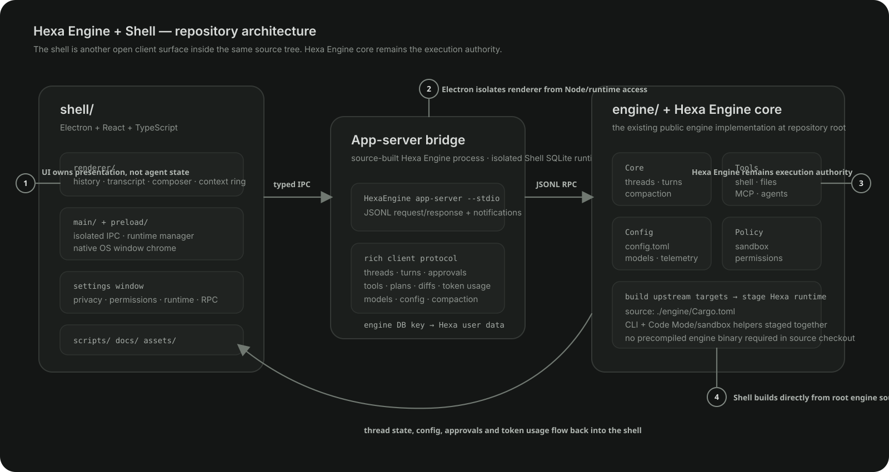

# Architecture

This is the canonical Hexa architecture guide. Source paths below intentionally point to the implementation under `shell/` and `engine/`.

Hexa separates its desktop client from the upstream-derived Rust agent engine. The `engine/` workspace is a downstream copy of OpenAI Codex `codex-rs`; references to what the engine "owns" below describe runtime responsibility, not intellectual-property ownership. Hexa-maintained code supplies the Electron shell, integration layer, and repeatable downstream adaptations described in [`UPSTREAM_COMPATIBILITY.md`](../UPSTREAM_COMPATIBILITY.md).

```text
Electron renderer
      │ narrow preload bridge
Electron main process
      │ JSON-RPC over stdio
Rust app server
```

The Rust engine owns conversations, turns, tools, approvals, sandboxing, compaction, persistence, and model behavior. The desktop client renders that state and provides native operating-system integration.



## Source layout

```text
engine/                 Rust engine workspace
shell/src/main/         Electron host and engine lifecycle
shell/src/preload/      isolated renderer bridge
shell/src/renderer/     React interface
shell/src/shared/       shared TypeScript types
shell/scripts/          build and maintenance scripts
```

There is one active engine workspace at the repository root.

## Desktop processes

### Renderer

The renderer normalizes and displays thread, turn, tool, approval, history, settings, and panel state. It runs with Node integration disabled, context isolation enabled, and Electron sandboxing enabled.

### Preload bridge

The preload exposes the limited IPC methods needed for app-server communication, runtime controls, native pickers, local preferences, resource opening, and other desktop operations. Node APIs are not exposed directly to React.

### Main process

The main process creates native windows, manages the engine runtime, owns filesystem and process access, and forwards app-server events through the preload bridge.

`BinaryManager` selects a complete runtime from packaged resources, the application-data cache, or a source build. `AppServerClient` launches `hexa-app-server` and maintains the JSON-RPC connection.

## State and configuration

Hexa keeps global engine data under `.hexashell` and passes `HEXA_ENGINE_HOME` and `HEXA_SQLITE_HOME` to the app server. Authentication, configuration, history, skills, plugins, and SQLite state therefore remain separate from other agent installations.

The engine's thread store is the conversation database. Electron does not maintain a parallel transcript database. Effective engine settings come from `config/read` and are changed through `config/batchWrite`.

## Transcript lifecycle

Items follow the app-server lifecycle:

```text
item/started
item delta or progress events
item/completed
turn/completed
```

The renderer keeps completed items in their original order. Active tool activity replaces the temporary thinking row; adjacent completed tool items can collapse into one expandable transcript cluster. Completed file changes also feed the message-level diff review.

Historical turns are reconciled from full engine thread data so commands, edits, reasoning, and messages remain available after reopening a conversation.

## Context and models

The context indicator combines `thread/tokenUsage/updated` with the effective model context window. If the engine does not provide a usable context size, Hexa displays token counts without inventing a percentage.

Model and reasoning choices come from the active account mode, engine catalog, and configuration. Local provider IDs remain intact even when the compact interface labels the selection as Custom.

## Protocol maintenance

Generated TypeScript definitions originate in:

```text
engine/app-server-protocol/schema/typescript
```

Refresh the shell snapshot with:

```sh
node hexa.mjs protocol-sync
```

The React state reducer handles supported notifications explicitly and ignores unknown notifications safely, allowing the protocol to grow without crashing older interface code. Settings → Developer includes a raw RPC console for development and diagnostics.
