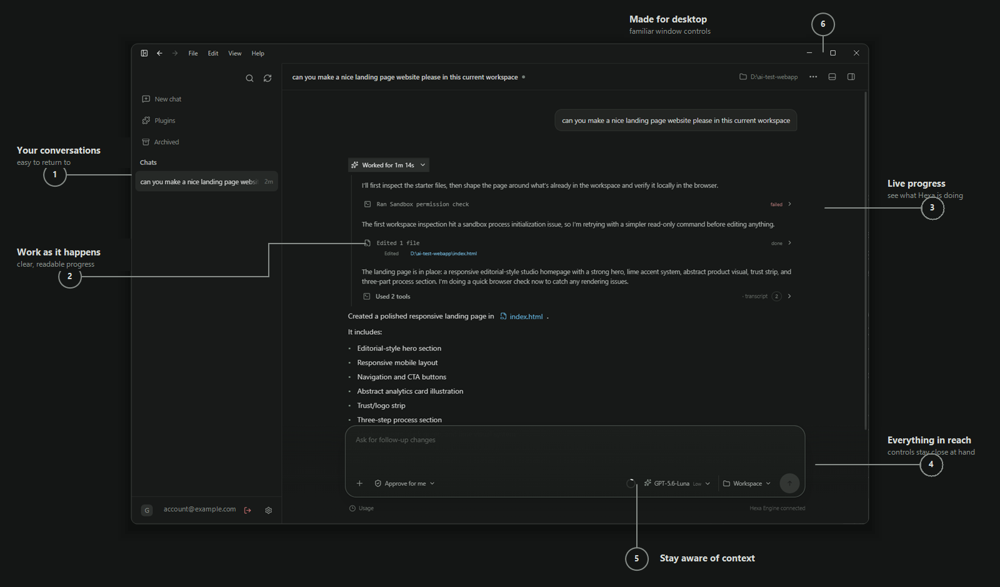

# Interface design

This is the canonical interface-design guide for Hexa.

Hexa is designed as a focused, native-feeling desktop workspace for coding agents. Its interface favors readable conversation, visible execution state, and controls that stay out of the way until needed.



## Visual rules

- dark neutral surfaces with restrained contrast;
- chat history remains visible on desktop unless intentionally collapsed;
- archive/delete controls appear only when a history row is hovered;
- the empty-chat composer sits visually centered in the conversation panel;
- active chats anchor the same composer near the bottom;
- model + reasoning live in one primary control;
- the permission profile remains next to the model control because it directly affects a turn;
- the context ring remains compact and readable through a tooltip instead of consuming permanent space;
- settings open in their own desktop window;
- Windows, macOS and Linux use native OS window frames/caption controls.

## Tool activity

### Thinking and active tools share one lane

Do not render this:

```text
Thinking
[tool card]
Thinking
[tool card]
Thinking
```

Render this state transition instead:

```text
Thinking
    ↓
〉_ Running pnpm typecheck…
    ↓
〉_ Ran 1 command
```

The active item inherits the same lane that was previously occupied by Thinking.

### Keep command activity in the transcript

`Running …`, `Ran commands`, `Edited files`, MCP execution, agent execution, and similar tool activity are transparent transcript rows. Every dialog and tool phase uses the same transcript row rhythm so one-call and batched-call rows keep even spacing above and below.

Opaque surfaces remain appropriate for things that are actually discrete UI objects — the composer, approval prompts, settings controls, user message bubbles, plan/review summaries, and large diff/output surfaces when needed.

Expanded command rows use a shell-output panel aligned to the transcript edge. It shows the command, scrollable output, and a success, running, or failure footer, with matching dark and light palettes.

### Terminal iconography

Command execution uses the terminal icon. Completed mixed tool clusters also use the terminal icon because the cluster represents an execution transcript. File/MCP/web/agent items retain their own icons inside the expanded transcript.

### Shimmer

Only active work shimmers. Completed summaries become stable muted text. The shimmer is deliberately slow enough to read as activity rather than a loading gimmick.

## Visual assets

The interface uses Lucide icons and Hexa's own artwork. Development reference images, when present, are not shipped with the app.
